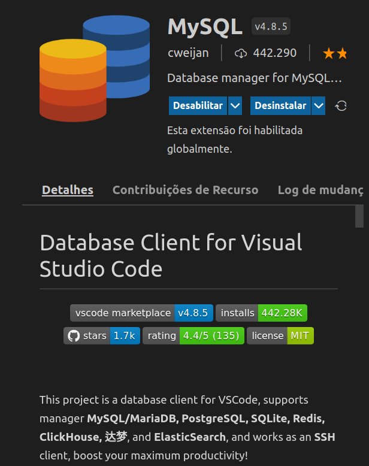

## Boas Vindas ao repositóiro de Treinamento de SQL !!

> Esse repositório foi criado para treinar consultas SQL > e desenvolver as seguintes habilidades:

- [x] - Modelar um banco de dados profissional;

- [x] - Identificar entidades, atributos e relacionamentos;
- [x] - Aplicar a 1ª, 2ª e a 3ª forma normal;
- [x] - Criar tabelas;

## Ferramentas gráficas utilizadas:

- [x] - Workbench SQL;

- [x] - Extensão VS Code Database Client for Visual Studio Code.

