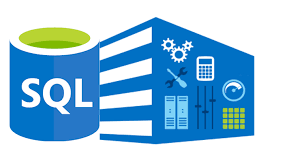

## Boas Vindas ao repositóiro de Treinamento de SQL !!
### SQL?
>SQL é uma linguagem padrão para trabalhar com bancos de dados relacionais. Ela é uma linguagem declarativa e que não 
>necessita de profundos conhecimentos de programação para que alguém possa começar a escrever queries, as consultas e 
>pedidps, que trazem resultados de acordo com o que você está buscando. SQL significa Standard Query Language, 
>literalmente a linguagem padrão para realizar queries.

>A linguagem SQL é utilizada de maneira relativamente parecida entre os principais bancos de dados relacionais do 
>mercado: Oracle, MySQL, MariaDB, PostgreSQL, Microsoft SQL Server, entre muitos outros. Cada um tem suas 
>características, sendo o MySQL e o PostgreSQL extremamente populares por possuírem versões gratuitas e de código aberto.

>É também uma linguagem que muitos profissionais acabam precisando aprender: seja quem usa Excel de forma pesada e acaba 
>migrando as informações para um banco de dados, seja um cientista de dados que usa Python para agregar os dados das 
>diferentes fontes de informações.

##### [Paulo Silveira 14/07/2019]('https://www.alura.com.br/artigos/o-que-e-sql?gclid=Cj0KCQjwuMuRBhCJARIsAHXdnqOHpfkc8_ER4MMjlYgbleKPbx6f3gBN3qjxzIkZ1e3sOdX05X_1JsQaAqtuEALw_wcB').

> Esse repositório foi criado para treinar consultas SQL 
> e desenvolver as seguintes habilidades:

- [x] - Modelar um banco de dados profissional;
- [x] - Identificar entidades, atributos e relacionamentos;
- [x] - Aplicar a 1ª, 2ª e a 3ª forma normal;
- [x] - Criar tabelas;

## Ferramentas gráficas utilizadas:

- [x] - Workbench SQL;
- [x] - Extensão VS Code Database Client for Visual Studio Code.

